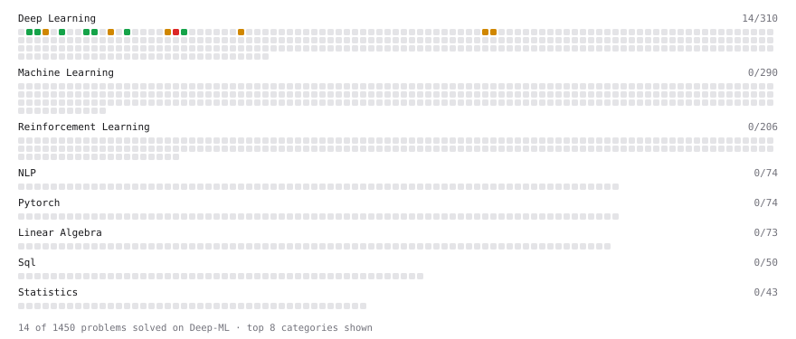

# Deep-ML

My machine learning practice from [Deep-ML](https://www.deep-ml.com). Every solution here was written by hand.

**14** solved · 14 problems · 0 labs · 0 math

[**Browse the interactive portfolio**](https://ErozTheForgotten.github.io/deep-ml/) to replay this filling in over time.

## Problems

| | Difficulty | Solved | |
| --- | --- | --- | --- |
| [Implement ReLU Activation Function](https://www.deep-ml.com/problems/42) | easy | 2026-09-07 | [solution](problems/0042-implement-relu-activation-function) |
| [Implement the Hard Sigmoid Activation Function](https://www.deep-ml.com/problems/96) | easy | 2026-09-07 | [solution](problems/0096-implement-the-hard-sigmoid-activation-function) |
| [Implementation of Log Softmax Function](https://www.deep-ml.com/problems/39) | easy | 2026-09-07 | [solution](problems/0039-implementation-of-log-softmax-function) |
| [KL Divergence Between Two Normal Distributions](https://www.deep-ml.com/problems/56) | easy | 2026-09-07 | [solution](problems/0056-kl-divergence-between-two-normal-distributions) |
| [Leaky ReLU Activation Function](https://www.deep-ml.com/problems/44) | easy | 2026-09-07 | [solution](problems/0044-leaky-relu-activation-function) |
| [Single Neuron](https://www.deep-ml.com/problems/24) | easy | 2026-09-07 | [solution](problems/0024-single-neuron) |
| [Softmax Activation Function Implementation ](https://www.deep-ml.com/problems/23) | easy | 2026-09-07 | [solution](problems/0023-softmax-activation-function-implementation) |
| [Compute the Hessian Matrix](https://www.deep-ml.com/problems/218) | medium | 2026-09-09 | [solution](problems/0218-compute-the-hessian-matrix) |
| [Implement Masked Self-Attention](https://www.deep-ml.com/problems/107) | medium | 2026-09-09 | [solution](problems/0107-implement-masked-self-attention) |
| [Implement Self-Attention Mechanism](https://www.deep-ml.com/problems/53) | medium | 2026-09-09 | [solution](problems/0053-implement-self-attention-mechanism) |
| [LoRA: Low-Rank Adaptation Forward Pass](https://www.deep-ml.com/problems/222) | medium | 2026-09-09 | [solution](problems/0222-lora-low-rank-adaptation-forward-pass) |
| [Single Neuron with Backpropagation](https://www.deep-ml.com/problems/25) | medium | 2026-09-07 | [solution](problems/0025-single-neuron-with-backpropagation) |
| [The Pattern Weaver's Code](https://www.deep-ml.com/problems/89) | medium | 2026-09-09 | [solution](problems/0089-the-pattern-weaver-s-code) |
| [Implement Multi-Head Attention](https://www.deep-ml.com/problems/94) | hard | 2026-09-14 | [solution](problems/0094-implement-multi-head-attention) |

---

_This file is regenerated by Deep-ML on every push._
